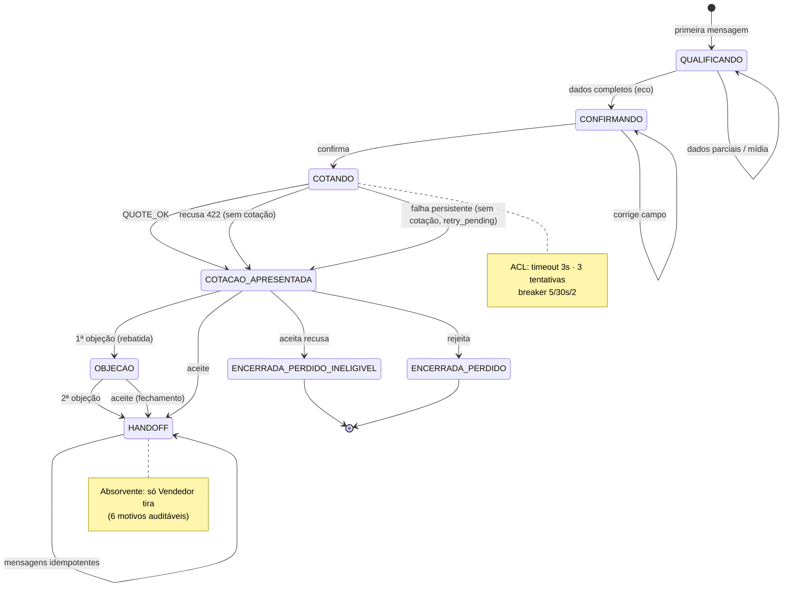
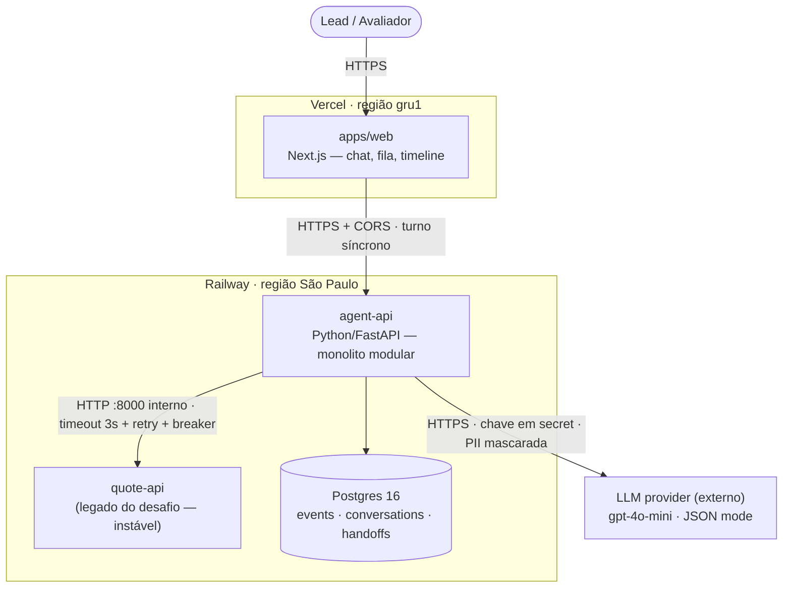
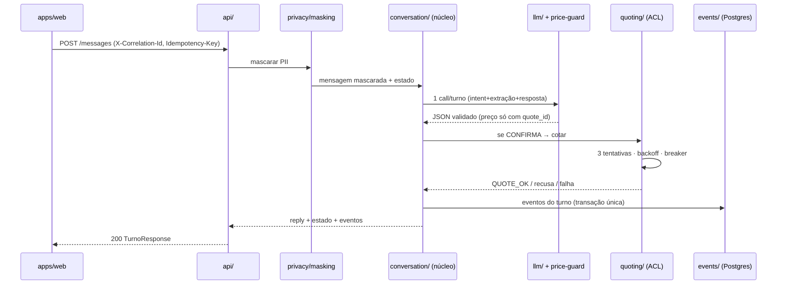

# 🗺️ Diagramas as-code (Mermaid)

> Etapa 12 §4 — renderizam no GitHub e no portal. Fonte da verdade das regras
> continua sendo a **spec** (tabela §1.3 é o que os testes executam); estes
> diagramas são a vista humana. Divergência diagrama↔tabela = bug de doc.

## Máquina de estados da conversa (spec §1)

*Qualquer estado ativo → `HANDOFF` por `preferencia_humana`/`fora_escopo`
(imediato) — omitido para legibilidade; inatividade 24h → `ENCERRADA_SEM_RESPOSTA`.*

## Containers (C4 nível 2 — ADR-0001/0008)

## Fluxo de um turno (spec §C4 nível 3)

